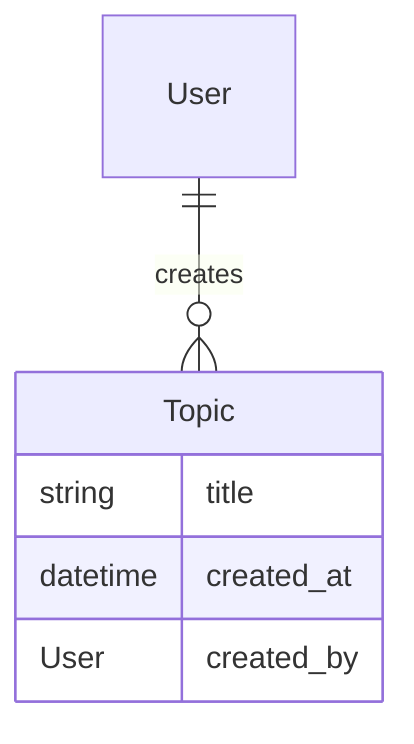

# Cohorts session 1

## Prerequisites

System with [git](https://git-scm.com/) and [docker compose](https://docs.docker.com/compose/) installed. Working unix-like environment (WSL2 for windows, or a mac [with developer tools installed](https://www.freecodecamp.org/news/install-xcode-command-line-tools/) or linux machine)

A github user account.

Editor or IDE ([PyCharm](https://www.jetbrains.com/pycharm/) recommended, either professional or community) capable of working with python files. I recommend you use the professional trial version.

[Pop](https://pop.com/) in order to pair with other members if not local.

## Setup

In github, [go to the template repository for this class](https://github.com/StrongMind/cohort_template), clone into your personal GitHub, by selecting "Use This Template".

In WSL2 (windows) or a terminal (Mac)

`git clone <your repo url here> ` where "your repo url here" is the URL of the cloned repository in your account

`docker-compose build`

Open the project in pycharm by opening the project folder inside of it

In PyCharm preferences (you may need to install the docker plugin, before this is available):

* go to your project
* go to "python interpreter"
* click the settings icon next to your interpreter
* click add
* select "Docker Compose" in the left of the dialog
* select the new button next to server
  * on a Mac choose Docker for Mac
  * (on windows?)

* choose "web" in service and then click "OK"

In WSL2 or a terminal:
* To get a bash prompt inside your docker environment;
  * `docker-compose run web bash`
* To start a new django project
  * `django-admin startproject cohort`

Those two steps should have created a new project inside your repository named "cohort". In the future, when we talk about "from a docker bash prompt", you will use `docker-compose run web bash` to get there. 

In PyCharm, right click on the `cohort` folder, then Mark directory as sources root.

Finally, right click on `docker-compose.yml` and click "run docker-compose.yml". (If you decided not to use PyCharm, you would run `docker-compose up` here.)

In a browser, [go to http://localhost:8000](http://localhost:8000). You should now see a welcome page. You now have a django app successfully running.

## Create an app

A django project consists of applications. These can either be applications you create yourself, or applications installed from python packages available on PyPI (the python package repository). Reusable applications are a quick way to get significant chunks of functionality very quickly, as we will show you later.

For now, though, let's start our first application!

From a docker bash prompt:
* `cd cohort`
* `python manage.py startapp forum` this command creates an application in the project named "forum".

In `cohort/settings.py`, you will see an `INSTALLED_APPS` section. This controls which applications a django project has installed. You can see several applications already installed that come as a standard part of django. Let's install our newly created application into this list, by adding "forum" to this list.

## Set Up tests

This project comes set up in advance to use `pytest-describe`. From a docker bash prompt in the cohort project directory, run `pytest`. You should see similar output to this.

```console
root@f861c41270fe:/code/cohort# pytest
================================================================================ test session starts ================================================================================
platform linux -- Python 3.10.3, pytest-7.1.1, pluggy-1.0.0
rootdir: /code/cohort
plugins: Faker-13.3.2, django-4.5.2, describe-2.0.1
collected 0 items                                                                                                                                                                   

=============================================================================== no tests ran in 0.06s ===============================================================================
root@f861c41270fe:/code/cohort# 

```

## Our first model

We're going to create a discussion system. When creating a system like this, it helps to start "model out"; this way, we can already know what the APIs of our dependencies look like. Here's what our first model will look like. It will have an established relationship with a model that already exists by default in django, the user model.




### Tests

Rename the file `tests.py` to `test_topic.py`.

Create a file in your cohort project directory called `pytest.ini` that contains the following

```ini
[pytest]
DJANGO_SETTINGS_MODULE=cohort.settings
```


If you are using PyCharm, you can automatically run tests whenever changes are made. This reduces feedback time significantly. To do this:

* Go to Run -> Edit Configurations
* Click the + in the top left of the dialog
* Choose pytest within Python tests
* Set the target to "script path" and in the path box below, select the cohort subdirectory in your project.
* Save this by pressing okay, then selecting Run -> Run pytest in cohort
* Test runs will appear at the bottom of you window; to turn on auto-test, select the icon to the left two below the green run icon.

Let's set up your first couple of tests working toward building this system.  Copy and paste the following into `test_topic.py`

```python
import factory.django
import pytest
from django.contrib.auth.models import User

from forum.models import Topic


class UserFactory(factory.django.DjangoModelFactory):
    class Meta:
        model = User

    email = factory.Faker('email')
    username = factory.Faker('user_name')


class TopicFactory(factory.django.DjangoModelFactory):
    class Meta:
        model = Topic

    title = factory.Faker('sentence')
    created_by = factory.SubFactory(UserFactory)


@pytest.mark.django_db
def describe_topic():
    def exists():
        TopicFactory()

    def saves_its_fields():
        topic = TopicFactory()

        sut = Topic.objects.get(pk=topic.id)

        assert sut.title == topic.title
        assert sut.created_by == topic.created_by

```

Now run the tests; if you're in a taught session, this is where we'll start. Otherwise, follow the errors!
